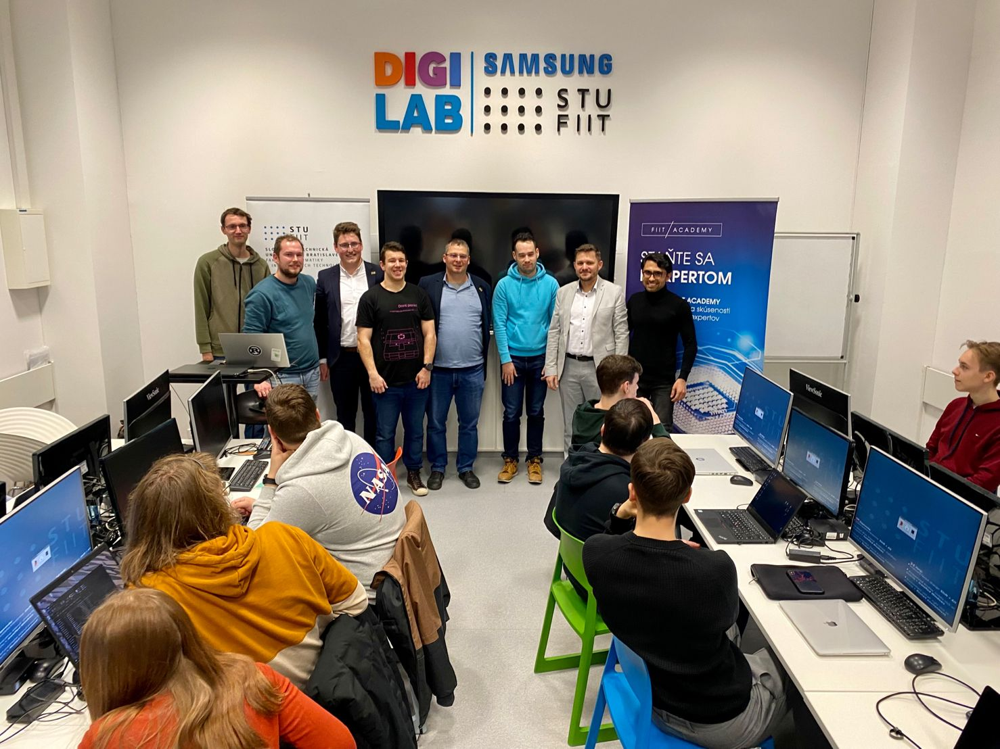
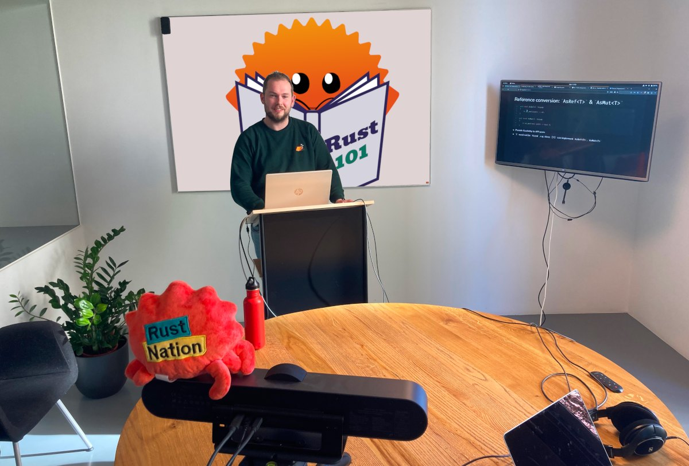

## Introducing....

# Rust 101

### A Rust university course

Henk Oordt - <henk@tweedegolf.com>

# &nbsp;

<center></center>

---
layout: cover
---

# Students need Rust?

<center></center>

---
layout: two-cols
---

# The other Rust

Gives us

- Fast software
- Maintainable code
- Happy developers
- Something to write about

::right::
<center></center>


---
layout: default
---

# TG 💘 Rust!

<center><video controls><source src="blog-scroll.webm"/>Not supported</video></center>

---
layout: cover
---

# Why?

```rust
let mut reasoning = "Rust is great and all, but...".to_owned();
loop {
  reasoning.push_str("There aren't a lot of job openings, because...");

  reasoning.push_str("Companies are hesitant to adopt it, because...");

  reasoning.push_str("There aren't many experienced developers, because...");
}
```

We need to `break` this cycle!

---
layout: image-right

image: https://c.tenor.com/D4aKcpzBNnMAAAAC/spongebob-meme.gif
---
# How?

## By sparking students' imagination
*and that of teachers, of course*

---
layout: default
---
# What?
Create your own course!

- Compose modules from topics
- Compose your course from modules
- [???]
- Profit!

## **Open source and ready to use**

---
layout: default
---

# How did it go?

<center></center>

---
layout: default
---

# How did it go?

<center></center>


---
layout: default
---

# Future

- People want this 
  - 2.3k⭐ on GitHub
  - Sponsored by Rust Foundation and Rust Edu
- Add new tracks
- Improve content
- Enable people to contribute

---
layout: end
---